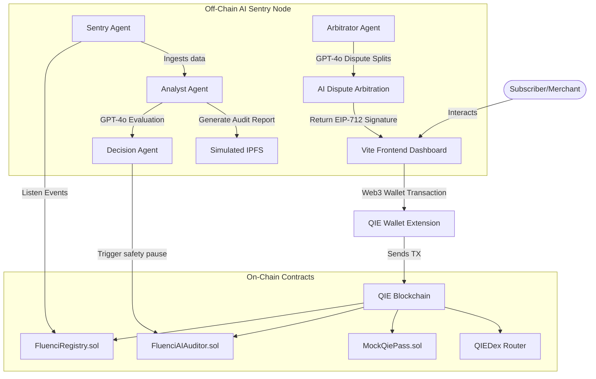

# Fluenci — Real-Time Streaming Payments with Autonomous AI Sentry & QIE Pass

Fluenci is a decentralized, real-time streaming payment protocol built on the **QIE Blockchain (Chain ID 1990)**. It enables subscribers to pay merchants continuously per second (e.g., for subscriptions, API usage, salaries) using `qUSDC` stablecoins.

Fluenci introduces two major innovations to Web3 billing:
1. **Tradeable Subscription NFTs**: Each payment stream is represented as a unique ERC-721 NFT. Ownership of a subscription can be transferred, gifted, or traded, automatically shifting the billing obligations to the new owner's wallet.
2. **Autonomous AI Sentry Network**: An off-chain Multi-Agent node (Sentry, Analyst, Decision, and Arbitrator) that monitors streams, uses OpenAI GPT-4o to analyze billing velocity anomalies, generates IPFS audit reports, and executes on-chain safety pauses autonomously.

---

## 🚀 QIE Mainnet Deployments (Chain ID 1990)

The protocol is deployed and active on QIE Mainnet. All mock contracts have been fully migrated and resolved natively:

* **FluenciRegistry**: [`0x0d21623aF12FF88B8ad12d2831e1FA715A0A7675`](https://mainnet.qie.digital/address/0x0d21623aF12FF88B8ad12d2831e1FA715A0A7675)
* **FluenciAIAuditor**: [`0x80b33a1A6625c394Df501991d4Cee0eA780A6C3d`](https://mainnet.qie.digital/address/0x80b33a1A6625c394Df501991d4Cee0eA780A6C3d)
* **AI Auditor Hot Wallet**: `0xfe5F1D13A31a5B86833ADF4486720331D6e4a6bb`

### Official QIE Ecosystem Integrations:
* **QIE Pass (KYC Staging)**: [`0x0766Ff824376CEf38CFa5C155A51E90578096e38`](https://mainnet.qie.digital/address/0x0766Ff824376CEf38CFa5C155A51E90578096e38)
* **QIE Stable Coin (qUSDC)**: [`0x3F43DA82eC9A4f5285F10FaF1F26EcA7319E5DA5`](https://mainnet.qie.digital/address/0x3F43DA82eC9A4f5285F10FaF1F26EcA7319E5DA5)
* **QIEDex Router**: [`0x08cd2e72e156D8563B4351eb4065C262A9f553Ef`](https://mainnet.qie.digital/address/0x08cd2e72e156D8563B4351eb4065C262A9f553Ef)
* **QIE Domain Resolver (Mock)**: [`0xD0B0432395B2f414A4d9B74BD51523687a02883c`](https://mainnet.qie.digital/address/0xD0B0432395B2f414A4d9B74BD51523687a02883c)

---

## 🛠️ Architecture Overview



### 1. The Real-Time Payment Stream Model (Pull-Based)
* Fluenci utilizes a **pull-based streaming architecture**. Creating a stream does not lock tokens inside the contract up-front.
* Instead, it registers stream parameters on-chain. When a merchant claims accrued funds, the contract executes a direct `transferFrom` pull from the subscriber's wallet.
* This allows subscribers to maintain custody of their tokens, but claims will fail if the subscriber's balance falls below the accumulated amount.

### 2. Multi-Agent AI Sentry Node
* **Sentry Agent**: Ingests on-chain blockchain events (`SubscriptionCreated`, `DisputeOpened`, etc.) in real-time.
* **Analyst Agent**: Queries OpenAI GPT-4o to audit stream rates and verify the merchant domain's reputation. It compiles an audit report and pins it to simulated IPFS, generating a cryptographic hash.
* **Decision Agent**: Executes autonomous safety overrides on-chain. If risk exceeds 75%, it signs and broadcasts a `triggerSafetyPause` transaction to lock the stream.
* **Arbitrator Agent**: Resolves subscriber disputes. Evaluates text evidence via GPT-4o, determines a refund/payout split, and issues a cryptographic signature. The contract verifies this signature on-chain to distribute disputed funds.

### 3. QIE Pass KYC Integration
* Users must be identity-verified to interact with the protocol.
* Integrates with the **QIE Pass Sandbox API** (`https://did-stapi.qie.digital`) to create verification requests, poll for user consent, verify credentials, and register identity status on-chain.

### 4. QIEDex Swap & Reverse Swap
* Integrates a DeFi swap panel supporting **`QIE ⇄ qUSDC`** directly through the official QIEDex pools.
* Automatically handles multi-step approvals for the router and utilizes direct JSON-RPC EIP-1193 signature calls to prevent browser wallet hangs.

---

## 🚀 Quick Start Guide

### Prerequisites
* [Node.js](https://nodejs.org/) (v18+)
* [QIE Wallet Extension](https://chrome.google.com/webstore) connected to QIE Mainnet (or Testnet for sandbox sandbox identity checks).

### 1. Smart Contracts
To view, compile, or test the smart contracts:
```bash
cd contracts
npm install
npx hardhat compile
```

### 2. Backend Node Server
The backend handles the AI Sentry loops, OpenAI assessments, and QIE Pass sandbox integrations.

1. Navigate to the server folder:
   ```bash
   cd server
   npm install
   ```
2. Configure your `.env` file (`server/.env`):
   ```ini
   PORT=5001
   RPC_URL=https://rpc1mainnet.qie.digital
   REGISTRY_ADDRESS=0x0d21623aF12FF88B8ad12d2831e1FA715A0A7675
   AUDITOR_ADDRESS=0x80b33a1A6625c394Df501991d4Cee0eA780A6C3d
   AI_PRIVATE_KEY=0xfe3a3e160db3dd96335940f08821596df0a6ec13199568c1819a4d449b139703
   OPENAI_API_KEY=your_openai_api_key_here
   QIEPASS_API_URL=https://did-stapi.qie.digital
   QIEPASS_PUBLIC_KEY=your_qiepass_public_key_here
   QIEPASS_SECRET_KEY=your_qiepass_secret_key_here
   QIEPASS_CLAIMS=firstName
   ```
3. Start the node server:
   ```bash
   npm start
   ```

### 3. Frontend App
The React Vite frontend handles the subscriber panel, merchant dashboard, DEX swaps, and the AI Security Desk.

1. Navigate to the frontend folder:
   ```bash
   cd frontend
   npm install
   ```
2. Start the local Vite server:
   ```bash
   npm run dev
   ```
3. Open `http://localhost:5173` in your browser.

---

## 🔬 Testing the AI Sentry Pipeline

To demonstrate the full autonomous security pipeline:
1. Ensure your **AI Sentry Node Server** is running and has a valid `OPENAI_API_KEY`.
2. Connect your wallet to the frontend, complete the **QIE Pass KYC** (using the `dev-qiepass.qie.digital` sandbox to approve requests), and swap some QIE for qUSDC.
3. Open the **AI Security Desk** tab in the dashboard.
4. Select an active payment stream, type an exploit reason, and click **Trigger Safety Pause**.
5. The Sentry Agent will capture the manual trigger:
   * **Analyst Agent** evaluates the stream risk via GPT-4o, compiles a report, and pins it to IPFS.
   * **Decision Agent** broadcasts the safety pause on-chain.
   * You will see the telemetry logs output in the desk's terminal, and the stream's status will instantly change to **"Paused by AI"**!
