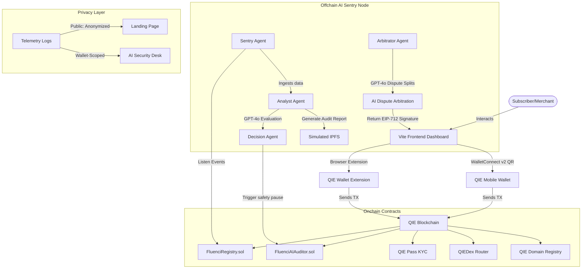

# Fluenci - AI-Shielded Real-Time Streaming Payments on QIE Blockchain

> **Stop Blind Streams. AI-Shielded Payments.**

Fluenci is a decentralized, real-time streaming payment protocol built on the **QIE Blockchain (Chain ID 1990)**. It enables subscribers to pay merchants continuously per second - for subscriptions, API usage, salaries, and more — using `QUSDC` stablecoins, all while an autonomous AI Sentry Network watches every transaction in real time.


---

## Key Innovations

### 1. Tradeable Subscription NFTs
Each payment stream is minted as a unique **ERC-721 NFT**. Subscription ownership can be transferred, gifted, or traded on any NFT marketplace. When the NFT changes hands, the smart contract automatically shifts billing obligations to the new owner's wallet.

### 2. Autonomous AI Sentry Network
An offchain **Multi-Agent AI node** (Sentry, Analyst, Decision, and Arbitrator agents) monitors every stream in real time. It uses **OpenAI GPT-4o** to analyze billing velocity anomalies, compiles IPFS audit reports, and can autonomously execute onchain safety pauses - no human intervention required.

### 3. Progressive KYC via QIE Pass
Merchants can receive payments without KYC for frictionless onboarding. However, **withdrawing/claiming** funds requires QIE Pass identity verification. This Progressive KYC model balances user experience with regulatory compliance.

### 4. Privacy-Preserving Telemetry
The public-facing AI Telemetry Node on the landing page anonymizes all sensitive data - wallet addresses, transaction hashes, stream IDs, and KYC identifiers are masked (`0x07f3••••05a8`). The AI Security Desk shows only the connected wallet's own activity (wallet-scoped filtering).

### 5. Native QIE Ecosystem - 5 Deep Integrations
Fluenci is built natively on the QIE ecosystem, integrating:
- **QIE Pass** - Decentralized identity verification (DID)
- **QIE Wallet** - Native browser wallet with gas overrides
- **QIE Stable Coin (QUSDC)** - Stablecoin for volatility-free payments
- **QIE Dex** - Decentralized exchange for QIE ⇄ qUSDC swaps
- **QIE Domains** - Human-readable `.qie` domain names resolved to wallet addresses

---

## QIE Mainnet Deployments (Chain ID 1990)

The protocol is deployed and active on QIE Mainnet. All contracts are fully verified and operational:

### Fluenci Protocol Contracts (v3 - with 0.5% protocol fee + auto-settle on terminate)
| Contract | Address |
|---|---|
| **FluenciRegistry** (v3) | [`0xddB7398B6bA13641eC66D9beFb67BA3F765c57C9`](https://mainnet.qie.digital/address/0xddB7398B6bA13641eC66D9beFb67BA3F765c57C9) |
| **FluenciAIAuditor** (v4) | [`0xF38d9458d14d916B60026693a76FBe7cDEf651Fa`](https://mainnet.qie.digital/address/0xF38d9458d14d916B60026693a76FBe7cDEf651Fa) |
| **FluenciRouter** | [`0x75475647f52531D4086296415392E4AA94b92de7`](https://mainnet.qie.digital/address/0x75475647f52531D4086296415392E4AA94b92de7) |
| **AI Auditor Hot Wallet** | `0xfe5F1D13A31a5B86833ADF4486720331D6e4a6bb` |

### QIE Ecosystem Integrations
| Integration | Address |
|---|---|
| **QIE Pass (KYC)** | [`0x0766Ff824376CEf38CFa5C155A51E90578096e38`](https://mainnet.qie.digital/address/0x0766Ff824376CEf38CFa5C155A51E90578096e38) |
| **QIE Stable Coin (qUSDC)** | [`0x3F43DA82eC9A4f5285F10FaF1F26EcA7319E5DA5`](https://mainnet.qie.digital/address/0x3F43DA82eC9A4f5285F10FaF1F26EcA7319E5DA5) |
| **QIEDex Router** | [`0x08cd2e72e156D8563B4351eb4065C262A9f553Ef`](https://mainnet.qie.digital/address/0x08cd2e72e156D8563B4351eb4065C262A9f553Ef) |
| **QIE Domain Registry** | [`0xcfbcbca93c607590b211c81c7dbcdbd7ed6cc6ed`](https://mainnet.qie.digital/address/0xcfbcbca93c607590b211c81c7dbcdbd7ed6cc6ed) |

---

## Latest Developments (June 2026)

### WalletConnect v2 Mobile Support
- **QIE Mobile Wallet** can now connect to Fluenci by scanning a QR code via WalletConnect v2
- The connect modal shows an instant QR code for mobile scan, with no page reload required
- Relay URL upgraded to `wss://relay.walletconnect.com` for broader network compatibility
- Network-blocked users (restricted ISPs/hotspots) receive an immediate, actionable error message within 8 seconds instead of a silent 30-second timeout
- A **Retry** button is shown on failure - users can reconnect without reopening the modal

### Multi-Wallet Support (EIP-6963)
- The wallet selection modal now supports **three connection paths**:
  1. **QIE Wallet (Browser Extension)** - detected via EIP-6963 provider announcements
  2. **QIE Mobile Wallet** - WalletConnect v2 QR code scan
  3. **Other EVM Wallets** - any injected EIP-6963 provider (MetaMask, Rabby, etc.)

### Live Protocol Dashboard
- Powered by QIE Mainnet, the landing page now tracks **settled volume**, **DEX swaps**, and **protocol revenue** in real time directly from onchain events

### Fluenci Blog
- Full in-app blog (`/blog`) with articles on streaming payments, QIE ecosystem, AI sentry design, and tokenomics
- No external CMS dependency - content is bundled in the frontend

### Fluenci Docs
- Complete in-app protocol documentation (`/docs`) covering:
  - Smart contract ABI references
  - API endpoints
  - Integration guides for merchants and subscribers
  - QIE Pass KYC flow

### Fluenci AI Chat
- Interactive AI assistant embedded in the dashboard
- Answers questions about the protocol, streams, DEX swaps, and QIE ecosystem using context-aware responses
- Powered by OpenAI GPT-4o via the backend node

### UI/UX Refinements
- Wallet option buttons redesigned with clearer hover contrast for improved text readability
- Modal connection flow tightened - loading states, error states, and success states are all clearly differentiated
- Protocol revenue stats displayed with animated counters on the landing page

---

## Architecture Overview



### 1. Real-Time Payment Stream Model (Pull-Based)
Fluenci uses a **pull-based streaming architecture**:
- Creating a stream does **not** lock tokens inside the contract upfront
- Stream parameters are registered onchain (rate per second, cliff time, stop time)
- When a merchant claims accrued funds, the contract executes a direct `transferFrom` pull from the subscriber's wallet
- Subscribers maintain full custody of their tokens at all times
- Claims fail gracefully if the subscriber's balance falls below the accumulated amount

### 2. Multi-Agent AI Sentry Node
The AI Sentry is a multi-agent system running as an Express.js backend:

| Agent | Role | Technology |
|---|---|---|
| **Sentry Agent** | Ingests onchain events (`SubscriptionCreated`, `StreamPaused`, `DisputeOpened`, etc.) in real-time | ethers.js event listeners |
| **Analyst Agent** | Audits stream rates, verifies merchant domain reputation via QIE Domains, compiles audit reports with IPFS CIDs | OpenAI GPT-4o |
| **Decision Agent** | Evaluates risk scores and autonomously triggers onchain safety pauses when risk exceeds 75% | Autonomous TX signing |
| **Arbitrator Agent** | Resolves subscriber disputes by evaluating evidence, determining refund/payout splits, and signing EIP-712 messages | OpenAI GPT-4o |

### 3. Progressive KYC via QIE Pass
- **Subscribers**: Must complete QIE Pass KYC to create or resume streams
- **Merchants**: Can receive payments without KYC for frictionless onboarding, but **must complete QIE Pass to withdraw/claim** accrued funds
- Integration via the **QIE Pass Sandbox API** (`https://did-stapi.qie.digital`) with HMAC-SHA256 authentication
- The `FluenciRegistry.sol` enforces KYC checks in `claimStream()` via the `IQiePass` interface

### 4. QIE Domain Resolution
- Resolves human-readable `.qie` domain names to wallet addresses
- Uses the official QIE Domain Registry (EIP-1967 proxy) at `0xcfbcbca93c607590b211c81c7dbcdbd7ed6cc6ed`
- Since no onchain reverse lookup exists, domain resolution is performed by querying the wallet's transaction history via the QIE Explorer API and decoding registration calldata (selector `0xf2101e95`)
- Connected wallets with registered `.qie` domains see their domain name displayed in the dashboard

### 5. QIEDex Swap & Reverse Swap
- Integrated DeFi swap panel supporting **QIE ⇄ qUSDC** directly through official QIEDex pools
- Automatically handles multi-step approvals for the router
- Utilizes direct JSON-RPC EIP-1193 signature calls to prevent browser wallet hangs
- Swap volume is tracked and displayed on the landing page stats in real time

### 6. Privacy-Preserving Telemetry
Fluenci implements a dual-mode telemetry system:

| Mode | Endpoint | Behavior |
|---|---|---|
| **Public** (Landing Page) | `GET /telemetry` | All wallet addresses, tx hashes, stream IDs, and KYC identifiers are anonymized (e.g., `0x07f3••••05a8`) |
| **Private** (AI Security Desk) | `GET /telemetry?wallet=0x...` | Only logs related to the connected wallet are returned (wallet-scoped filtering) |

The anonymization engine masks any `0x`-prefixed hex string of 20+ characters, covering:
- Wallet addresses (40 hex chars)
- Transaction hashes (64 hex chars)
- Stream/subscription IDs (bytes32)
- KYC identifiers

---

## Landing Page Features

The landing page is designed to showcase the protocol's capabilities at a glance:

- **Typewriter Hero Title**: Dynamic cycling text - "Stop **Blind** / **Rogue** / **Unaudited** Streams" with a typewriter animation
- **Live Protocol Stats**: Real-time counters for Active Users, Settled Volume, Swap Volume (DEX), and App Revenue (0.5% fee) - powered directly from QIE Mainnet
- **AI Telemetry Node**: Live terminal widget pulling real telemetry from the backend with anonymized logs
- **Ecosystem Marquee Carousel**: Auto-scrolling infinite carousel showcasing all 5 QIE integrations with pause-on-hover
- **Feature Comparison Matrix**: Side-by-side comparison of Standard Web3 Streams vs. Fluenci AI-Shield
- **FAQ Accordion**: Expandable answers to common questions about the protocol

---

## Quick Start Guide

### Prerequisites
- [Node.js](https://nodejs.org/) (v18+)
- [QIE Wallet Extension](https://chrome.google.com/webstore) connected to QIE Mainnet (Chain ID: 1990)

### 1. Smart Contracts
To view, compile, or test the smart contracts:
```bash
cd contracts
npm install
npx hardhat compile
```

### 2. Backend Node Server
The backend handles the AI Sentry loops, OpenAI assessments, QIE Pass integrations, and privacy-preserving telemetry.

1. Navigate to the server folder:
   ```bash
   cd server
   npm install
   ```
2. Configure your `.env` file (`server/.env`):
   ```ini
   PORT=5001
   RPC_URL=https://rpc1mainnet.qie.digital
   REGISTRY_ADDRESS=0xddB7398B6bA13641eC66D9beFb67BA3F765c57C9
   AUDITOR_ADDRESS=0xF38d9458d14d916B60026693a76FBe7cDEf651Fa
   AI_PRIVATE_KEY=your_ai_private_key_here
   OPENAI_API_KEY=your_openai_api_key_here
   QIEPASS_API_URL=https://did-stapi.qie.digital
   QIEPASS_PUBLIC_KEY=your_qiepass_public_key_here
   QIEPASS_SECRET_KEY=your_qiepass_secret_key_here
   QIEPASS_CLAIMS=firstName
   START_BLOCK=8320000
   ```
3. Start the node server:
   ```bash
   npm start
   ```

### 3. Frontend App
The React Vite frontend handles the subscriber panel, merchant dashboard, DEX swaps, and the AI Security Desk.

1. Navigate to the frontend folder:
   ```bash
   cd frontend
   npm install
   ```
2. Start the local Vite server:
   ```bash
   npm run dev
   ```
3. Open `http://localhost:5173` in your browser.

> **Mobile Connection Note**: To connect via QIE Mobile Wallet (WalletConnect QR), ensure your network allows outbound WebSocket connections (`wss://`). If you are on a restricted network or mobile hotspot, enable a VPN before connecting.

---

## Project Structure

```
QieFlow/
├── contracts/                  # Solidity smart contracts (Hardhat)
│   ├── contracts/
│   │   ├── FluenciRegistry.sol # Core streaming payment registry + NFT minting
│   │   └── FluenciAIAuditor.sol# AI safety pause enforcement contract
│   ├── scripts/
│   │   └── deployMainnet.ts    # QIE Mainnet deployment script
│   └── hardhat.config.ts       # Hardhat configuration for QIE Mainnet
│
├── server/                     # Express.js backend (AI Sentry Node)
│   ├── server.js               # Multi-agent AI system + REST API + telemetry
│   └── .env                    # Environment variables (RPC, keys, etc.)
│
├── frontend/                   # React Vite frontend
│   ├── src/
│   │   ├── App.jsx             # Main app + landing page + dashboard routing
│   │   ├── App.css             # Landing page styles (marquee, cards, etc.)
│   │   ├── hooks/
│   │   │   └── useFluenci.js   # Core Web3 hook (wallet, WalletConnect v2, contracts)
│   │   ├── components/
│   │   │   ├── SubscriberPanel.jsx    # Subscribe, pause, resume, terminate streams
│   │   │   ├── MerchantDashboard.jsx  # Claim funds, view merchant streams
│   │   │   ├── AISecurityDesk.jsx     # Wallet-scoped telemetry + manual safety pause
│   │   │   ├── TransactionModal.jsx   # Multi-step transaction progress modal
│   │   │   ├── ConnectWallet.jsx      # Multi-wallet modal (Extension + WalletConnect + EVM)
│   │   │   ├── FluenciAIChat.jsx      # In-app AI assistant powered by GPT-4o
│   │   │   ├── BlogPage.jsx           # In-app blog (streaming payments, QIE ecosystem)
│   │   │   ├── FluenciDocs.jsx        # In-app protocol documentation
│   │   │   └── QieDoodleGame.jsx      # Fluenci Snake Arcade (pay-as-you-play)
│   │   └── assets/                    # Logos (QIE Pass, Wallet, qUSDC, DEX, Domains)
│   └── index.html
│
└── README.md                   # This file
```

---

## Economic Sustainability & Revenue Model

For a decentralized subscription protocol merging AI Agents and Web3 payments to be viable, it must demonstrate a clear path to self-sustainability. Fluenci achieves this through a multi-tiered model:

### 1. Protocol Stream Fee (Tollbooth Model)
- **Mechanism**: A protocol fee of **0.5%** is charged when a merchant claims funds from an active stream via `claimStream()`
- **Execution**: The `FluenciRegistry` splits every payment:
  - **99.5%** goes to the merchant
  - **0.5%** is redirected to the **Fluenci Treasury**
- **Sustainability**: Scales linearly with TVL and transaction volume - displayed live on the landing page

### 2. Premium AI Sentry Subscription (SaaS)
- **Mechanism**: Basic security telemetry is free. Merchants can subscribe to **AI Sentry Premium Defense** for faster queues, deeper reputation checks, and custom alert thresholds
- **Sustainability**: Provides stable, predictable cash flow to cover offchain AI node operational costs

### 3. AI Dispute Arbitration Fee
- **Mechanism**: Resolving disputes involves gas consumption (EIP-712 signatures) and LLM API costs. A fixed fee is charged upon opening a dispute

### 4. Yield-Bearing Collateral Escrows (Future Phase)
- **Mechanism**: In escrowed stream setups, the contract will deposit idle collateral into liquid staking/lending pools on QIE, with generated yield flowing to the Treasury

---

## Testing the AI Sentry Pipeline

To demonstrate the full autonomous security pipeline:

1. **Start the backend**: Ensure the AI Sentry Node Server is running with a valid `OPENAI_API_KEY` and `AI_PRIVATE_KEY`
2. **Connect wallet**: Open the frontend, connect your QIE Wallet, and complete **QIE Pass KYC** verification
3. **Get qUSDC**: Use the integrated DEX to swap QIE for qUSDC stablecoins
4. **Create a stream**: Open the Subscriber Panel, enter a merchant address, rate, and duration to create a payment stream
5. **Trigger the AI**: Open the **AI Security Desk** tab, select an active stream, type an exploit reason, and click **Trigger Safety Pause**
6. **Watch the AI work**:
   - **Sentry Agent** captures the manual trigger
   - **Analyst Agent** evaluates stream risk via GPT-4o and compiles an IPFS audit report
   - **Decision Agent** broadcasts the safety pause transaction onchain
   - Telemetry logs appear in real time in the Security Desk terminal
   - The stream's status changes to **"Paused by AI"**

---

## Security & Privacy

| Feature | Implementation |
|---|---|
| **Wallet-Scoped Telemetry** | AI Security Desk only shows logs related to the connected wallet |
| **Public Data Anonymization** | Landing page masks all 0x hex identifiers (addresses, tx hashes, stream IDs) |
| **Progressive KYC** | Merchants receive payments freely but must verify identity to withdraw |
| **EIP-712 Signatures** | AI dispute resolutions are cryptographically signed and verified onchain |
| **Pull-Based Custody** | Subscriber tokens never leave their wallet - only pulled on claim |
| **WalletConnect v2** | Mobile connections use encrypted WalletConnect v2 relay protocol |

---

## Fluenci Snake Arcade

Fluenci includes a built-in **Snake game** as a pay-as-you-play demo. It demonstrates micro-payment streaming in action:

- **Subscribe & Play**: Opens a QUSDC micro-stream at 0.0001 QUSDC/sec to `fluenci.qie`
- **Live Telemetry**: Score, session time, and QUSDC streamed update in real-time
- **Auto-Settle on Terminate**: When the player clicks "Stop Streaming", the contract auto-settles accumulated QUSDC to the merchant before deactivation
- **Best Score Tracking**: Persisted in localStorage across sessions
- **Touch Controls**: Supports swipe on mobile devices

---

## Links

- **X (Twitter)**: [x.com/fluenciAI](https://x.com/fluenciAI)
- **GitHub**: [github.com/mrnetwork0001/Fluenci](https://github.com/mrnetwork0001/Fluenci)

---

## License

© 2026 Fluenci Protocol. Built for QIE Blockchain Hackathon. All rights reserved.
